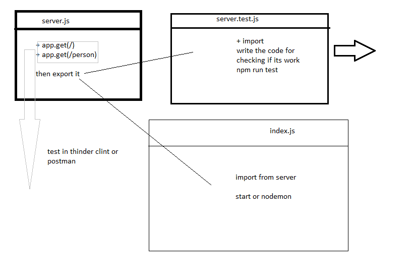

# basic-express-server

## note 
1. what is the fraimwork and libarary .
2. dependince VS devDependince
> npm i  -D it to install as devDep 
3. event loop 
4. asynchronous VS  synchronous 
5. JEST to make test drive for the code .
6. express is a fraimwork
7. uesing the spyOn to knew what happen in hte code .
8. middelwaer that we can use in the express.

## LINKS 
...............................................................
[pull request](https://github.com/qusaiqeisi/basic-express-server/pull/1)

..............................................................
[github action](https://github.com/qusaiqeisi/basic-express-server/runs/3280568158)

...........................................................
[heroku](https://qusai-basic-express-server.herokuapp.com/)

......................................................
[heroku](https://qusai-basic-express-server.herokuapp.com/person?name=qusai)

...................................................
[GitHub repo](https://github.com/qusaiqeisi/basic-express-server)

##  Test 
> npm run test 
> nodemon

## Growing Thinking

> how we can devided the backend work in simple way that make it more easy to read by ather devloper .

> how to make the testing to check the code and praper it for deploying 

